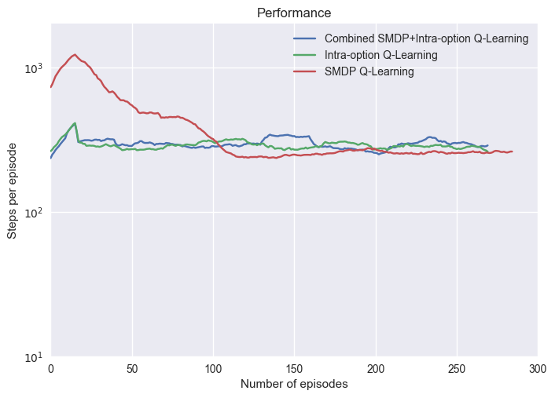
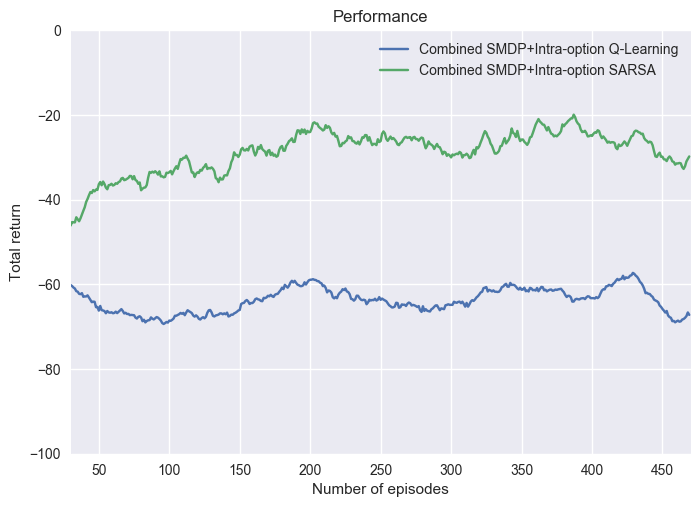

# Option-value learning algorithms

This project explains, implements, and briefly compares the following algorithms:
* SMDP Q-Learning
	* Sutton, Precup & Singh, "Between MDPs and semi-MDPs: A framework for temporal abstraction in reinforcement learning", pg. 195
* Intra-option Q-Learning
	* Sutton, Precup & Singh, "Between MDPs and semi-MDPs: A framework for temporal abstraction in reinforcement learning", pg. 204
* Combined SMDP/Intra-option Q-Learning
	* Stolle, "Automated Discovery of Options in Reinforcement Learning", pg. 20-21
* Combined SMDP/Intra-option SARSA

The following commands were issued to get the results for the first graph (SMDP vs Intra-option vs combination).
cd src
python3 gridworld.py -a smdpq     -n 0.333 -d 0.9 -l 0.25 -k 300 -w 50 -s 70 -e 0.1 -g RoomsGridSafe
python3 gridworld.py -a intraoptq -n 0.333 -d 0.9 -l 0.25 -k 300 -w 50 -s 70 -e 0.1 -g RoomsGridSafe
python3 gridworld.py -a combooptq -n 0.333 -d 0.9 -l 0.25 -k 300 -w 50 -s 70 -e 0.1 -g RoomsGridSafe
python3 graphs.py

And for the second graph (combined SMDP/Intra-option Q-learning vs SARSA):
rm results_*
rm returns_*
python3 gridworld.py -a combooptq     -n 0.3333 -d 0.99 -l 0.2 -k 500 -w 50 -s 70 -e 0.3333 -g RoomsGrid
python3 gridworld.py -a combooptsarsa -n 0.3333 -d 0.99 -l 0.2 -k 500 -w 50 -s 70 -e 0.3333 -g RoomsGrid

The first commit contains code that was taken from the UC Berkeley AI Course, available at: http://ai.berkeley.edu/reinforcement.html.
Second commit contains modifications for RTDP, Value Iteration DP, Gauss-Seidel DP, and n-step algorithms (from prior assignment).
Third commit and onward contains changes made for this assignment.

The reinforcement learning framework code was extended to support options.

